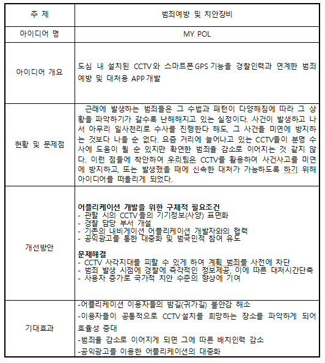
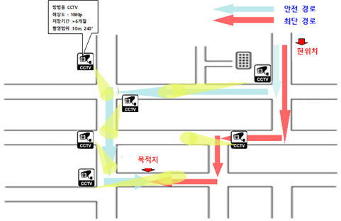

**본 폴더는 과학치안 아이디어 공모전과 관련된 폴더입니다.**

### 주제

 - 도심 내 설치된 CCTV와 스마트폰 GPS기능을 경찰인력과 연계한 범죄예방 및 대처용 APP **'MyPoL'**
 

### 개요

  CCTV 정보를 고시한 지도를 구현하여 안전한 귀가길 분석, 귀가 시작, 끝, 비상상황 발생을 담당 상황실과 등록된 보호자에게 자동전송
  
  
  CCTV설치 희망 장소 데이터 수집.
  
  

### 기능

 1. **CCTV 정보 표면화**
     > CCTV 정보를 표면화하여 CCTV 기기 정보를 이 어플로 조회할 수 있게 된다. 또한 CCTV의 가동범위, 화질성능, 저장용량 등을 쉽게 알 수 있게 하여 위험으로부터의 감지를 손쉽게 할 수 있도록 도와준다.
     
     
     
     
 2. **안전귀가 기능**
     > 현재 장소에서 도착 지점까지 CCTV의 사각지대가 가장 적은 경로를 탐색하여 안내, 특이사항 전송.
     
     > 1) 귀가 시작 : 담당 부서에 귀가 정보를 등록.(EX:홍길동“복현동 24-17에서 산격동 302-40 까지 귀가 시작”) 사용자에게는 다음의 주의사항을 권고.(주위를 살피며 이동할 것, 홀드키 3번을 누르면 자동으로 신고)
     

     > 2) 귀가 중 : CCTV 사각지대로 진입 시 진동알림. 한 장소에서 오래 머무르거나(휴대폰을 떨어트릴 수 있음)지정된 경로의 이탈이 발생할 경우 담당 부서에 알림을 자동 전송하고, 담당 직원은 곧바로 가장 가까운 CCTV를 확인 하거나 사용자에게 통화하여 GPS의 오작동인지 돌발 상황인지를 판단.  

     > 3) 귀가 후 : 사용자의 본인 인증 후 지정한 보호자 및 상황실에 안전하게 귀가가 완료되었음을 알림. 
     

 3. **에스코트 기능**
 
     > 인터넷 상 만남 증대로 인한(취업 사기, 어플 만남, 직접 거래등) 만남의 경계가 허물어지며 그만큼의 위험 증대에 따른 사전경보 지원 시스템
 
 
 
 
 4. **CCTV설치 희망 지점 요청**
 
     > 용자들이 어플리케이션을 사용하면서 많은 사람들이 공통적으로 다니는 경로상에 CCTV가 없어 설치를 요청하고자 할 때, 이용자가 어플리케이션 지도상에 CCTV희망 지점을 표시 
     
     > 그러면 어플리케이션 관리자는  CCTV설치가 가장 시급한 곳을 한눈에 파악. 효율적인 CCTV배치가 가능
     
     
     
     
 
